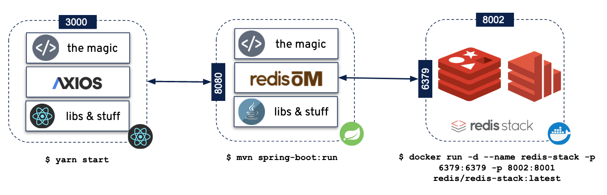

# Spring Redis Movies 

This project contains multiple resources to explore and use SpringBoot + RediSearch + Redis JSON

High level arch: 


## Building and Running in Gitpod

Gitpod can spin up a fully featured developer friendly environment with both Visual Studio and Spring Redis Movies application running for you.

[](https://gitpod.io/#https://github.com/redis-projects/redis-movies)

1. Once the environment is available, the projects will compile, build containers and start with docker compose
2. You can use the Gitpod Visual Studio `TERMINAL` window to use docker compose as instructed below.
3. Wait a minute or so and Gitpod will detect the ports from the application (80, with an Nginx reverse proxy in front of the SpringBoot application on port 8080) and RedisInsight (8001) for you to access over the Gitpod web routing. You can check in the Gitpod Visual Studio `PORTS` window.
4. Make sure to select the `Open Browser` to open those.
5. Note: as we are loading ~10000 movies, the application may show empty while this loads. Make sure to refresh or check with RedisInsight.


## Working with Docker

There is a docker compose script which will bootstrap all the components required to make this demo work.

1. Run `docker compose up` from the root dir
2. The containers will start in the correct order
3. You can also selectively build with `docker compose build backend` for example
4. On startup:

- The Java Service will bootstrap `Redis-Stack` with 9876 movies
- - if needed, update the docker-compose env to disable: MOVIE_INSERT_ON_STARTUP=false
```bash
movie-service  | 2022-11-07 16:19:34.500  INFO 1 --- [main] io.redis.configuration.DataLoader        : Loading sample data movies file from dir : './' with the provided path : ./movies.json
movie-service  | 2022-11-07 16:19:35.445  INFO 1 --- [main] io.redis.configuration.DataLoader        : Loading 9897 movies into Redis
movie-service  | 2022-11-07 16:19:47.184  INFO 1 --- [main] io.redis.configuration.DataLoader        : Finished loading data into Redis
```

## Working with Redis Enterprise Cloud or Azure Cache Redis Enterprise

You can also provision your Redis database with [Redis Enterprise Cloud](https://redis.com/redis-enterprise-cloud/overview/) or Azure Cache for Redis Enterprise.

1. Create your [free trial](https://redis.com/try-free/) for Redis Enterprise Cloud
2. Edit the `docker-compose.yml` to remove the Redis Stack container and the `redis` container dependency
3. Change the environment variables to fit with your deployment for the Redis host, port and password
```
  # Java Movie Service
  backend:
    image: movie-backend:latest
    container_name: backend
    #depends_on:
    #  - redis
    #links:
    #  - "redis:redis"
    build:
      context: .
      dockerfile: Dockerfile
    environment:
      - REDIS_HOST=ava.northeurope.redisenterprise.cache.azure.net
      - REDIS_PORT=10000
      - REDIS_PASSWORD=iruJTVbObd8XWyR1J4bgE35esZCRjO9qreHd6m6j7jM=
      - MOVIE_INSERT_ON_STARTUP=true
      - MOVIE_DATA_DIR=./
```


## Working with Projects locally

---
**NOTE**: Startup Procedure Required:
1. Start Redis-Stack `$ docker start redis-stack`
2. Start the Java Service `$ mvn spring-boot:run`
3. Start the frontend `$ yarn start`
4. ✨  Done
----

1. Redis Stack : https://redis.io/docs/stack/
2. Spring-Redis Java Movies Service ---> [Java Service](./spring-redis-search-om-api)
3. React Frontend Movies ---> [React Movies Site](./frontend)


### Software Reqs 

 - Docker 
 - Java 11+ 
 - NPM 8+
 - Node v18.7.0
 - Yarn 1.22.17+

### React Preview 


